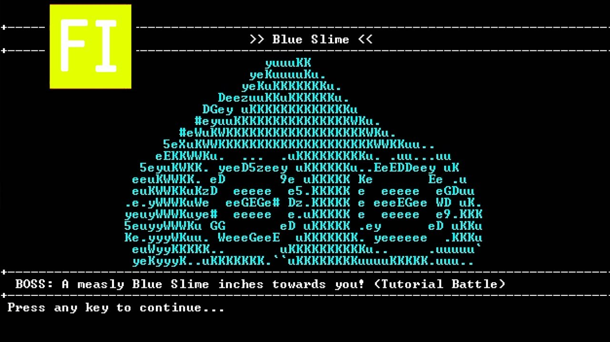
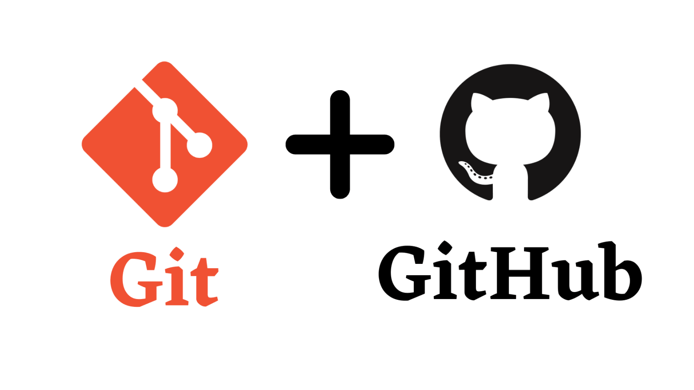

# FOP Valley

You might read the assignment question in 

> Text adventures (sometimes synonymously referred to as interactive fiction) are text-based games wherein worlds are described in the narrative and the player submits typically simple commands to interact with the worlds.

This is an extract taken from the Wikipedia. As of your Fundamental of Programming (FOP) Assignment, you're required to design a interactive fiction on your own and distribute it in .JAR file for others to try, play and rate.

## 1 - Introduction



In this assignment, your task is to create an interactive fiction game where players can use the Command Line Interface (CLI) to interact with the system and navigate through the story. Your goal is to develop an intriguing narrative where players can acquire and control heroes, similar to the game Genshin Impact, and progress by overcoming challenges. Along the journey, players will receive hints to guide them towards discovering the final truth of the story.

Ensure that your game effectively allows player to manage movement, item collection, hero acquisition, and game progression. Design an engaging story that captivates players and provides an immersive experience. The CLI interface should enable seamless interaction between players and the game world, allowing them to make choices and navigate through the storyline.

## 2 - Basic Requirement

### 2.1 Map Design (3 marks)

<div style="text-align:center">
    
</div>

Certainly, an engaging game necessitates an intriguing map replete with various elements seamlessly integrated into its design. A well-crafted map should be expansive and thoughtfully planned, rendering it even more enjoyable and challenging by establishing connections between diverse locations within the game world.

A sandbox game with only one location to explore can become monotonous. It becomes much more captivating and challenging when there are multiple distinct places, each with its own unique characteristics and features for players to discover. Furthermore, it's essential that each location is sufficiently large; otherwise, there won't be enough content for players to explore.

#### Requirements

1. Create a virtual game environment consisting of the following locations:
   - **Hometown**: A place where players can rest, upgrade their items, and engage in various activities.
   - **Forest**: An area where players can face monsters and collect loot for upgrading.
   - **Tower of Monsters**: The ultimate challenge that players must conquer to win the game.

2. Implement a teleportation system allowing players to move between locations seamlessly.

3. Ensure that the system displays the entire view of each location.

4. Design each location with a minimum size of 100x100, aligning with the provided descriptions.

5. Enable players to move freely using the W, A, S, and D keys without the need to press 'Enter' for movement.

6. Implement a dynamic screen view that shows the specific area of the map to indicate the player's current location.

7. Allow players to pause and save the game at any time by pressing the 'Esc' key.

These enhancements ensure a smoother and more immersive gaming experience within the FOP Valley virtual world.

### 2.2 - Creating archetypes (2 marks)

You are required to create a minimum of **5 unique archetypes**, each with their own base attributes and growth rates. While the base attributes can be tailored to your game design, they should include the following properties and behaviors:

```java
int level; // Represents the hero's level
int experience; // Tracks the hero's experience points
int manaPoints; // Indicates the hero's mana points
int healthPoints; // Represents the hero's health points
List<String> statusEffects; // Stores any status effects applied to the hero

public void levelUp() {
    // Implement the logic for leveling up the hero
}
```

You are not restricted to the specific data types or variable names mentioned in the example code. For instance, you can utilize alternatives such as `double` for mana points (`double manaPoints`) or a list of integers for status effects (`List<Integer> statusEffectsList`). The choice of data types and variable names should be reasonable and align with your game's requirements.

In addition to considering the growth rates for each attribute, it is crucial to incorporate the following growth rate into your code:

```java
public void levelUp() {
    this.healthPoints += 200;
    this.manaPoints += 300;
}
```

However, you are not restricted to implementing such an algorithm that increases the `healthPoints` linearly. It may not be sensible to increase the `healthPoints` by 300 if the character already has 100,000 `healthPoints`. Feel free to devise a more nuanced solution for scaling the character's `healthPoints` appropriately.

Additionally, it's important to note that when a character levels up, they have the ability to fully restore both their HP and MP (Health Points and Mana Points). This adds an element of reward and progression for the player's character as they advance in the game.

Here are some additional attributes that you can consider incorporating into your hero class:

```java
int criticalChance; // Represents the hero's chance of dealing a critical hit
int manaRegeneration; // Indicates the amount of mana regenerated per interval (e.g., per 5 seconds)
int healthRegeneration; // Represents the amount of health regenerated per interval (e.g., per 5 seconds)
int physicalDefense; // Indicates the hero's physical defense capability
int magicalDefense; // Represents the hero's magical defense capability
```

In addition to the base attributes mentioned earlier, these attributes can enhance the depth and complexity of your hero class. You can adjust the attribute names and data types according to your game design.

### 2.3 - Design Monster (3 marks)

In any RPG (Role-playing game), monsters are a common feature. While keeping in mind that you are not restricted in designing your monster class, you may consider designing the Monster class as follows:

```java
// Define the Monster class to represent in-game monsters.
class Monster {
    String name;            // Name of the monster.
    int healthPoints;       // Current health points of the monster.
    int manaPoints;         // Current mana points of the monster.
    int defense;           // Defense attribute for mitigating damage.
    int attack;            // Attack attribute for dealing damage.
    List<Ability> abilityList; // List of abilities that the monster can use.
    List<Droppable> dropList;  // List of items that can be dropped when the monster is defeated.
}
```

Your task is to design **at least seven unique monsters** that are scattered throughout the map. Some of these monsters may appear in groups in certain areas, and players can encounter them multiple times in those areas to obtain materials from them.

### 2.4 - Design abilities (5 marks)

Similar to DotA 2, Genshin Impact and any other games, the heroes usually have their own abilities. The abilities could have special effect, including `Silence`, that is, making the opponent unable to cast a skill on your character; Perhaps `Damage`, that is, merely cause damage to the opponent.

Create at least 3 abilities for each archetypes. These abilities will only become accessible once the character reaches a specific level. To illustrate, let's introduce a character named the "Barbarian." The first abilities, dubbed "Roaring," will unlock and become usable once the character reaches level 5.

```md
Barbarian
--> HP: [:::::           ] (45 / 60)
--> MP: [//////////////  ] (80 / 100)
+-------------------------------------------------------------+
OPERATION: 1 / 3

>> Starter
[S1] Attack
[S2] Defend
[S3] Heal                   < -20 MP, +200 HP, ->
[S4] Use item
[S5] Escape

>> Abilities
[A1] Roaring                < -10 MP,    0 HP, Cast silence>
[A2] <Locked - 10>
[A3] <Locked - 15>
[A4] <Locked - 20>
+-------------------------------------------------------------+
```

### 2.5 Round-based Battle System (5 marks)

Now that we have archetypes, monsters, and abilities in place, the next step is to implement the battle system. In a text-based RPG game, players are allowed to engage in round-based battles through interfaces or command-line operations. During each round, players can make moves, including using abilities or making attacks. The number of operations a player can perform in one round may increase as their character levels up.

```md
> You have HIT the skeleton warrior, causing 151 damage!

Skeleton Warrior
--> HP: [::              ] (27 / 60)
--> MP: [//////////////  ] (80 / 100)

> CRITICAL! Skeleton Warrior has SLASHED you for 57 damage!

Barbarian
--> HP: [:::::           ] (45 / 60)
--> MP: [//////////////  ] (80 / 100)
+-------------------------------------------------------------+
OPERATION: 1 / 3

>> Starter
[S1] Attack
[S2] Defend
[S3] Heal                   < -20 MP, +200 HP, ->
[S4] Use item
[S5] Escape

>> Abilities
[A1] Rabid Lunge            < -10 MP,    0 HP, Cast silence>
[A2] <Locked - 10>
[A3] <Locked - 15>
[A4] <Locked - 20>
+-------------------------------------------------------------+
```

### 2.5 Inventory system (2 marks)

There must be a place where the player can store all of their weapons and loot, and that place is the inventory. In the inventory, the player can check the items stored and also discard items when needed, keeping in mind that the inventory size is limited. Here's a glimpse of how the inventory interface might look:

```bash
Inventory (3 / 20)
[1] Sword (Quantity: 1)
    - A sharp sword that appears to have felled many monsters.
    - Attributes:
        - Attack: +15
        - Defense: +3

[2] Apple (Quantity: 5)
    - Fresh apples picked from the apple tree. Consuming one revives 15 HP.

[3] Wood (Quantity: 25)
    - Wood gathered in the forest, an essential material for crafting weapons.

[A] View Next
[B] View Previous
[B] Discard an item
```

### 2.6 Shop system (4 marks)

Absolutely, having a shop is a common feature in RPG games. It serves as a place where players can purchase superior equipment, acquire materials for weapon upgrades, and even sell off their unused items. It's essential that players receive a receipt for each transaction they make in the shop. This not only provides a record of their purchases but also enhances the realism and immersion of the in-game economy.

Here's how the shop system might look like:

```bash
+==========================+
+           Shop           +
+==========================+
   .------\ /------.
   |       -       |
   |               |
   |               |
   |               |
_______________________
===========.===========
  / ~~~~~     ~~~~~ \
 /|     |     |\
 W   ---  / \  ---   W
 \.      |o o|      ./
  |                 |
  \    #########    /
   \  ## ----- ##  /
    \##         ##/
     \_____v_____/

+============================+
> Hello! How can I help you?
+============================+

[1] Sell Items
[2] Buy Items
[3] Exit the Shop

>
```

If the player wishes to sell items, they might encounter the following page.

```bash
Sell Items

[1] Sword (Quantity: 1, Sell Price: 500)
[2] Apple (Quantity: 5, Sell Price: 25)
[3] Wood (Quantity: 25, Sell Price: 10)

[A] View Next
[B] View Previous
[C] Exit

Please enter 'sell <item_number> quantity <quantity>' if you wish to sell anything.

>
```

How can a player make a purchase? You can see the process in the following:

```bash
Buy items
[1] The cherry (Price: $200)
[2] The spaghetti (Price: $500)
[3] A magic sword (Price: $100000)

More actions
[A] View Next
[B] View Previous
[C] View Cart
[D] Exit

Hints
[1] Enter `pick item <item_number> quantity <number>` to put the item to your cart.
[2] Enter `buy` to confirm the payment.
[3] Enter `invoice` to generate an invoice
[4] Enter `view item <item_number>` to view the item details

>
```

### 2.7 Weapon System

#### 2.7.1 Design weapons for each archetypes (3 marks)

Weapons can be a significant attraction for players. A good weapon can greatly enhance the player's engagement with the game, motivating them to explore and seek out these weapons. However, not all weapons are suitable for every archetype. Clearly, a barbarian is not suited for wielding a bow; instead, they should wield a sword. Similarly, a wizard would probably not use a gun, as wizards tend to harness the power of magic to combat monsters.

The provided code snippet serves as a valuable reference for designing weapons in your game. While you are not limited to the specific naming convention or data types, it's essential to include all the mentioned elements for a comprehensive weapon design. Here's an explanation of each element:

```java
class Weapon {
    String name;             // The name of the weapon (e.g., "Fiery Sword")
    String archetype;        // The archetype or character class suitable for this weapon (e.g., "Warrior")
    String description;      // A description of the weapon (e.g., "A blade engulfed in flames.")
    int attack;              // The weapon's attack power
    int defend;              // The weapon's defensive capabilities
    int strength;            // Strength attribute added when equipped the weapon
    int agility;             // Agility attribute added when equipped the weapon
    int intelligence;        // Intelligence attribute added when equipped the weapon
    List<WeaponEffect> effects; // A list of special effects or enchantments the weapon can have
    Wearing type;            // The type of weapon (e.g., clothes, shoes, etc.)
}
```

You can use this as a basis for defining and customizing various weapons in your game, ensuring that each weapon has a name, archetype suitability, description, relevant attributes, special effects, and a weapon type specified.

#### 2.7.2 Upgrade the weapon (2 marks)

Furthermore, a weapon should be upgradeable to gain additional effects as the game progresses. As monsters become increasingly formidable, the player's weapon should evolve to match the rising challenge, ensuring that it remains effective throughout the game.

Consider the following `View Weapon Information`:

```bash
Deathsong +7
+--------------------------------+
| Archetype          |  Wizard   |
| Level Required     |  6        |     
| Attack             |  48 + 15  |
| HealthPoint        |  40 + 23  |
| Evasion            |  30 + 27  |
+--------------------------------+
```

The number `+7` should indicate the weapon has been upgraded successfully for 7 times already. It is worth noting that the color of `+7` displayed in the console and the `+23` which is attribute upgraded should be marked in different color for the player to recognize it easily.

#### 2.7.3 Blacksmith Shop (3 marks)

<div style="text-align:center">
    
</div>

> A blacksmith is a person who makes and repairs things in iron by hand

The player cannot upgrade their weapon independently, as this would severely disrupt game balance. Instead, they should visit a specialized location, such as a blacksmith shop, where they must pay for both the necessary materials and the upgrade costs

```bash
+=========================================+
+        A professional blacksmith        +
+=========================================+
⠀⠀⠀⠀⠀⠀⠀⠀⠀⠀⠀⢀⣀⠀⠀⠀⠀⠀⠀⠀⠀⠀⠀⠀⠀⠀⠀⠀⠀⠀
⠀⠀⠀⠀⠀⠀⠀⠀⠀⠀⣰⣿⣿⣷⡄⠀⠀⠀⠀⠀⠀⠀⢠⣄⣤⣦⣤⣀⠀⠀
⠀⠀⠀⠀⠀⠀⠀⠀⠀⠀⢿⣿⣿⣿⡇⠀⠀⠀⠀⠀⠀⠀⠀⠈⠉⠛⠿⠟⠀⠀
⠀⠀⠀⠀⠀⠀⠀⠀⣠⠀⠘⢿⣿⠟⠀⢠⡀⠀⠀⠀⠀⠀⠀⠀⣰⡗⠀⠀⠀⠀
⠀⠀⠀⠀⠀⢠⣾⠀⣿⠀⣷⣦⣤⣴⡇⢸⡇⠀⣷⠀⠀⠀⠀⣰⡟⠀⠀⠀⠀⠀
⠀⠀⠀⠀⠀⣿⣿⠀⣿⣤⣈⣉⣉⣉⣠⣼⡇⠀⣿⡆⠀⠀⣰⡟⠀⠀⠀⠀⠀⠀
⠀⠀⠀⠀⠀⣿⣿⠀⣿⣿⣿⣿⣿⣿⣿⣿⡇⠀⣿⠇⠀⠀⠛⠀⠀⠀⠀⠀⠀⠀
⠀⠀⠀⠀⠀⠛⠛⠀⠛⠛⠛⠛⠛⠛⠛⠛⠃⠀⠛⠀⠀⠀⠀⠀⠀⠀⠀⠀⠀⠀
⠀⠀⠀⠀⣤⣤⣤⣤⣤⣿⣿⣿⣿⣿⣿⣿⣿⣿⣿⣿⣿⣿⣇⠀⠀⠀⠀⠀⠀⠀
⠀⠀⠀⠀⠈⠻⣿⣿⣿⣿⣿⣿⣿⣿⣿⣿⣿⣿⣿⣿⣿⣿⣿⣿⣷⣤⠀⠀⠀⠀
⠀⠀⠀⠀⠀⠀⠈⠙⠛⣿⣿⣿⣿⣿⣿⣿⣿⣿⣿⣿⣿⣿⡿⠟⠋⠀⠀⠀⠀⠀
⠀⠀⠀⠀⠀⠀⠀⠀⠀⠿⠿⠿⣿⣿⣿⣿⣿⣿⣿⠿⠿⠿⠇⠀⠀⠀⠀⠀⠀⠀
⠀⠀⠀⠀⠀⠀⠀⠀⠀⠀⠀⣰⣿⣿⣿⣿⣿⣿⣿⣧⡀⠀⠀⠀⠀⠀⠀⠀⠀⠀
⠀⠀⠀⠀⠀⠀⠀⠀⢀⣠⣾⣿⣿⣿⣿⣿⣿⣿⣿⣿⣿⣦⡀⠀⠀⠀⠀⠀⠀⠀
⠀⠀⠀⠀⠀⠀⠀⠘⠛⠛⠛⠛⠛⠛⠛⠛⠛⠛⠛⠛⠛⠛⠛⠛⠃⠀⠀⠀⠀⠀
+=========================================+
> The brave traveler, how can I help you? 
+=========================================+
[1] You look handsome today!
[2] I would like to upgrade my weapon.
[3] Quit
+=========================================+
```

To make the game be more interesting, the player can opt to chat with the blacksmith and the player will receive the response from the blacksmith. For instance:

```bash
+=========================================+
+        A professional blacksmith        +
+=========================================+
⠀⠀⠀⠀⠀⠀⠀⠀⠀⠀⠀⢀⣀⠀⠀⠀⠀⠀⠀⠀⠀⠀⠀⠀⠀⠀⠀⠀⠀⠀
⠀⠀⠀⠀⠀⠀⠀⠀⠀⠀⣰⣿⣿⣷⡄⠀⠀⠀⠀⠀⠀⠀⢠⣄⣤⣦⣤⣀⠀⠀
⠀⠀⠀⠀⠀⠀⠀⠀⠀⠀⢿⣿⣿⣿⡇⠀⠀⠀⠀⠀⠀⠀⠀⠈⠉⠛⠿⠟⠀⠀
⠀⠀⠀⠀⠀⠀⠀⠀⣠⠀⠘⢿⣿⠟⠀⢠⡀⠀⠀⠀⠀⠀⠀⠀⣰⡗⠀⠀⠀⠀
⠀⠀⠀⠀⠀⢠⣾⠀⣿⠀⣷⣦⣤⣴⡇⢸⡇⠀⣷⠀⠀⠀⠀⣰⡟⠀⠀⠀⠀⠀
⠀⠀⠀⠀⠀⣿⣿⠀⣿⣤⣈⣉⣉⣉⣠⣼⡇⠀⣿⡆⠀⠀⣰⡟⠀⠀⠀⠀⠀⠀
⠀⠀⠀⠀⠀⣿⣿⠀⣿⣿⣿⣿⣿⣿⣿⣿⡇⠀⣿⠇⠀⠀⠛⠀⠀⠀⠀⠀⠀⠀
⠀⠀⠀⠀⠀⠛⠛⠀⠛⠛⠛⠛⠛⠛⠛⠛⠃⠀⠛⠀⠀⠀⠀⠀⠀⠀⠀⠀⠀⠀
⠀⠀⠀⠀⣤⣤⣤⣤⣤⣿⣿⣿⣿⣿⣿⣿⣿⣿⣿⣿⣿⣿⣇⠀⠀⠀⠀⠀⠀⠀
⠀⠀⠀⠀⠈⠻⣿⣿⣿⣿⣿⣿⣿⣿⣿⣿⣿⣿⣿⣿⣿⣿⣿⣿⣷⣤⠀⠀⠀⠀
⠀⠀⠀⠀⠀⠀⠈⠙⠛⣿⣿⣿⣿⣿⣿⣿⣿⣿⣿⣿⣿⣿⡿⠟⠋⠀⠀⠀⠀⠀
⠀⠀⠀⠀⠀⠀⠀⠀⠀⠿⠿⠿⣿⣿⣿⣿⣿⣿⣿⠿⠿⠿⠇⠀⠀⠀⠀⠀⠀⠀
⠀⠀⠀⠀⠀⠀⠀⠀⠀⠀⠀⣰⣿⣿⣿⣿⣿⣿⣿⣧⡀⠀⠀⠀⠀⠀⠀⠀⠀⠀
⠀⠀⠀⠀⠀⠀⠀⠀⢀⣠⣾⣿⣿⣿⣿⣿⣿⣿⣿⣿⣿⣦⡀⠀⠀⠀⠀⠀⠀⠀
⠀⠀⠀⠀⠀⠀⠀⠘⠛⠛⠛⠛⠛⠛⠛⠛⠛⠛⠛⠛⠛⠛⠛⠛⠃⠀⠀⠀⠀⠀
+=========================================+
> Wow! Thank you. So, how can I help you?
+=========================================+
[1] You look handsome today!
[2] I would like to upgrade my weapon.
[3] Quit
+=========================================+
```

This code snippet displays how the interface might appear when the player chooses to upgrade their weapon. Here's what the interface looks like when the player makes that choice:

```bash
+=========================================+
+        A professional blacksmith        +
+=========================================+
⠀⠀⠀⠀⠀⠀⠀⠀⠀⠀⠀⢀⣀⠀⠀⠀⠀⠀⠀⠀⠀⠀⠀⠀⠀⠀⠀⠀⠀⠀
⠀⠀⠀⠀⠀⠀⠀⠀⠀⠀⣰⣿⣿⣷⡄⠀⠀⠀⠀⠀⠀⠀⢠⣄⣤⣦⣤⣀⠀⠀
⠀⠀⠀⠀⠀⠀⠀⠀⠀⠀⢿⣿⣿⣿⡇⠀⠀⠀⠀⠀⠀⠀⠀⠈⠉⠛⠿⠟⠀⠀
⠀⠀⠀⠀⠀⠀⠀⠀⣠⠀⠘⢿⣿⠟⠀⢠⡀⠀⠀⠀⠀⠀⠀⠀⣰⡗⠀⠀⠀⠀
⠀⠀⠀⠀⠀⢠⣾⠀⣿⠀⣷⣦⣤⣴⡇⢸⡇⠀⣷⠀⠀⠀⠀⣰⡟⠀⠀⠀⠀⠀
⠀⠀⠀⠀⠀⣿⣿⠀⣿⣤⣈⣉⣉⣉⣠⣼⡇⠀⣿⡆⠀⠀⣰⡟⠀⠀⠀⠀⠀⠀
⠀⠀⠀⠀⠀⣿⣿⠀⣿⣿⣿⣿⣿⣿⣿⣿⡇⠀⣿⠇⠀⠀⠛⠀⠀⠀⠀⠀⠀⠀
⠀⠀⠀⠀⠀⠛⠛⠀⠛⠛⠛⠛⠛⠛⠛⠛⠃⠀⠛⠀⠀⠀⠀⠀⠀⠀⠀⠀⠀⠀
⠀⠀⠀⠀⣤⣤⣤⣤⣤⣿⣿⣿⣿⣿⣿⣿⣿⣿⣿⣿⣿⣿⣇⠀⠀⠀⠀⠀⠀⠀
⠀⠀⠀⠀⠈⠻⣿⣿⣿⣿⣿⣿⣿⣿⣿⣿⣿⣿⣿⣿⣿⣿⣿⣿⣷⣤⠀⠀⠀⠀
⠀⠀⠀⠀⠀⠀⠈⠙⠛⣿⣿⣿⣿⣿⣿⣿⣿⣿⣿⣿⣿⣿⡿⠟⠋⠀⠀⠀⠀⠀
⠀⠀⠀⠀⠀⠀⠀⠀⠀⠿⠿⠿⣿⣿⣿⣿⣿⣿⣿⠿⠿⠿⠇⠀⠀⠀⠀⠀⠀⠀
⠀⠀⠀⠀⠀⠀⠀⠀⠀⠀⠀⣰⣿⣿⣿⣿⣿⣿⣿⣧⡀⠀⠀⠀⠀⠀⠀⠀⠀⠀
⠀⠀⠀⠀⠀⠀⠀⠀⢀⣠⣾⣿⣿⣿⣿⣿⣿⣿⣿⣿⣿⣦⡀⠀⠀⠀⠀⠀⠀⠀
⠀⠀⠀⠀⠀⠀⠀⠘⠛⠛⠛⠛⠛⠛⠛⠛⠛⠛⠛⠛⠛⠛⠛⠛⠃⠀⠀⠀⠀⠀
+=========================================+
> Which weapon would you like to upgrade?
+=========================================+

[1] DeathSong (+6 -> +7)
    - Price: 15000/ 700
    - Material:
        - Iron (15/7)
        - Gold (3/5)
    - Changes
        - Attack: 76 -> 79
        - Strength: 82 -> 89

[A] View More

>
```

The upgrade interface will encompass all the necessary information on a single page. This includes the upgrade fee, required materials, and the expected changes to the weapon upon upgrading. Please note that the values will be presented in the format (a/b), where 'a' represents the current available resources in the player's inventory, and 'b' represents the resources needed for the upgrade.

## 3 - Extra Feature Requirement

### 3.1 - Save game functionality

It would be a great pity if someone couldn't save their game progress. Without the ability to save, they'd have to replay the same content repeatedly, which can become monotonous. To enhance the player experience, it's crucial to provide a way for them to record their current game status. Additionally, the game could remind them to save their progress before exiting, in case they forget to do so. Players would greatly appreciate this feature, as it ensures they don't lose their hard-earned progress.

### 3.2 - Player Account and Leaderboard

It would be a fantastic idea for individuals to register separate accounts, allowing each of them to play independently. Additionally, the inclusion of a leaderboard could serve as motivation for players to invest more time in leveling up and to continue progressing by challenging the Tower of Monsters.

### 3.3 - Abnormal input Handling

Mistakes can occur, whether unintentionally or intentionally. Therefore, our game should be capable of handling these abnormal inputs wisely and, perhaps, provide valuable feedback to inform the player about what's wrong with the input. It could be a typo or an unrecognized command.

### 3.4 - Export as JAR

Not everyone is a programmer; for example, our target audience could be a businessman, a Year 1 student, or even our grandmother. They might not be familiar with Java or all the setup and dependencies that come with it. Therefore, it would be better to package the code as a JAR (Java Archive) and automatically set up all the necessary files and dependencies without requiring human intervention.

### 3.5 Open Source and Collaboration

A great game is often the result of collaborative efforts rather than a solo endeavor. It thrives on player feedback and can benefit from contributions from programmers around the world. To ensure your game can be continually improved, consider open-sourcing your code and creating a platform for others interested in enhancing the game's resources, such as the item list, archetypes, and maps. Additionally, allowing your character to experience other groups' worlds and acquire new items is a great idea. This might involve communication and collaboration with other groups, which can lead to a richer and more engaging gaming experience.

### 3.6 Some comments

Some of your friends might ask whether they should design a Graphical User Interface (GUI) for their assignment. However, it's important to note that there are no marks allocated for creating a GUI in this assignment. The reason for this is that the essence of Fundamentals of Programming (FOP) lies not in spending your time dealing with technologies like JavaFX or Java Swing, which are less relevant in today's software development landscape.

It's perfectly acceptable to harness the capabilities of ChatGPT to assist you while working on your assignments. You may want to explore the use of an embedded database and incorporate SQL syntax in your code to streamline your work. Additionally, always keep modularity in mind and strive to avoid hard-coding. For example, if your project involves extensive dialogues for various conversations, it's advisable to store them in a .txt file rather than embedding them directly in the code. This approach makes modifications and amendments to the text considerably easier.

If you are seeking for the possible input and output, you might watch the following videos on Youtube:

1. [SanctuaryRPG - (Classic Text Adventure Game)](https://www.youtube.com/watch?v=_nuS86ITjIM)
2. [Open world Ascii based Python RPG | Python Curses](https://www.youtube.com/watch?v=DX1a8Uz12Xc)
3. [Python Text RPG Showcase | OldenRPG](https://www.youtube.com/watch?v=rz_2ml0AQ4k)

## 4 - Reminders

### 4.1 Modularity

#### 4.1.1 Object-Oriented Programming (OOP)

You need to apply the principles of Object-Oriented Programming (OOP) in your code to eliminate redundant code. It is important to grasp the concept of abstraction and effectively utilize classes, abstract classes, interfaces, and enums. Let's consider the following code as an example:

```java
class Monster {
    int healthPoints;
    int mana;
    List<String> status;    
}

class Hero {
    int healthPoints;
    int mana;
    List<String> status;
}
```

Instead of duplicating the variables `healthPoints`, `mana`, and `status`, we can create a suitable parent class to achieve abstraction. For instance:

```java
class Character {
    int healthPoints;
    int mana;
    List<String> status;
}

class Monster extends Character {

}

class Hero extends Character {

}
```

By refactoring the code in this manner, we indeed improve scalability and maintainability.

#### 4.1.2 Single Responsibility Principle (SRP)

<div style="text-align:center">
    
</div>

The Single Responsibility Principle is a fundamental programming principle that states that *A class should have only one reason to change.* It emphasizes that each class should be responsible for a single behavior or functionality.

In the given example, while applying OOP, it is important to ensure that each class is responsible for its own specific behavior. For instance, a `Hero` class may be responsible for attacking monsters or healing teammates, but it should not handle tasks unrelated to its core purpose, such as interacting with the operating system or managing database connections. Applying the SRP helps in maintaining cohesive and focused classes.

### 4.2 Using Git and Github for Cooperation

#### 4.2.1 Stop using Whatsapp or Telegram for exchanging .zip file!

It's quite common for newcomers who have no prior experience in programming to collaborate with others by sharing .zip files or sending .java files. However, this approach can lead to several issues.

1. The recipient needs to review all the code to identify the changes made, which can be time-consuming and error-prone.

2. If the recipient accepts all the changes and a bug is later discovered, it becomes challenging to revert to a bug-free version.

3. Frequent code changes can create confusion, especially when files are shared with different names or under the same name.

Therefore, it's advisable to refrain from using platforms like WhatsApp or Telegram for exchanging .zip files. Instead, consider using version control systems like Git and platforms like GitHub or Bitbucket, which are designed for efficient and collaborative code management.

<div style="text-align:center">
    
</div>

Among the various version control systems (VCS) available, Git stands out as one of the best options. Although some people may mistakenly believe that Git and GitHub are synonymous, they are, in fact, distinct entities.

Git is a distributed version control system designed to track changes in computer files. It excels at facilitating collaborative software development among programmers. Its key objectives include speed, data integrity, and support for distributed and non-linear workflows.

On the other hand, GitHub serves as an online hosting service specifically tailored for software development and version control using Git. It enhances Git's capabilities by providing features such as access control, bug tracking, software feature requests, task management, continuous integration, and project wikis.

In your assignment, it is crucial for you and your teammates to leverage Git and GitHub for effective team cooperation. Merely relying on copying and pasting or sharing ZIP files might suffice for small projects. However, as the codebase grows significantly, such approaches can lead to disastrous consequences. Utilizing Git and GitHub ensures streamlined collaboration and mitigates the challenges associated with managing large-scale projects.

#### 4.2.2 Recommended resources on studying Git

You might refer to the [Missing Semester | Lecture 6 | Version Control (Git) (2020)](https://www.youtube.com/watch?v=2sjqTHE0zok) and [GitHub Basics Tutorial - How to Use GitHub](https://www.youtube.com/watch?v=x0EYpi38Yp4) for more details.

#### 4.2.3 Brief Guideline on Using Git

```bash
# Configure your Git with a username and email
git config --global user.name "Your Name"
git config --global user.email "youremail@yourdomain.com"
```

If you've recently downloaded [Git](https://git-scm.com/), it's essential to set up your username and email. This information helps identify who made specific changes. If you have any inquiries about the changes, you can easily reach out to the contributor via email.

```bash
# Clone your repository from GitHub
cd path/to/your/code
git clone <GitHub_Repository_URL>
```

Once your Git configuration is in place, the next step is to register an account on GitHub and create a new repository. Copy the GitHub repository URL and paste it into the code snippet as indicated.

```bash
# Share your changes with your team
git add .
git commit -m "✨ Added new features"
git push
```

After making changes, like creating a new function such as `Login`, and wanting to share your work with your team, you should push the changes to the remote repository so that others can benefit from your code. Here's a breakdown of the commands:

- `git add .` stages all changes for commit.
- `git commit -m "your message"` provides a commit message to describe your changes.
- `git push` indicates that you've finalized your changes, at least in their current state, and you're ready to share them with others.

#### 4.2.4 Writing a good commit message

Writing informative commit messages and committing changes frequently not only helps others understand the modifications you've made but also enables easier access to specific older versions. A well-crafted commit message can serve as a helpful update log. Let's compare the following examples:

```bash
git commit -m "Add new files"
git commit -m "New updates"
git commit -m "Some changes"
```

and these messages:

```bash
git commit -m "Implement login authentication"
git commit -m "Fix bug in loading the file"
git commit -m "Implement embedded database for storage"
```

Which set of messages is more descriptive? Undoubtedly, the second set is more informative.

It is important to understand that commit messages should accurately reflect the changes made in the commit. The messages should be concise yet descriptive, providing a clear understanding of the modifications introduced. By following good commit message practices, developers can enhance collaboration and make it easier for others to navigate and utilize previous versions of the codebase.

### 4.3 Writing readable code

<div style="text-align:center">
    
</div>

Code is read more often than it is written. Avoid trying to be overly clever. While it may seem impressive to code swiftly with three-character variables or craft complex one-liners with numerous loops and clauses, both your present and future selves, along with your teammates, will benefit from the improved readability that comes from taking the time to give your methods and variables meaningful names, maintain proper spacing, and add meaningful comments. Always approach coding as if you'll need to explain it a week later, because the reality is, you will, even if it's just to yourself.

#### 4.3.1 Simple VS Complex Algorithm

Balancing the need to optimize an algorithm for time complexity in large-scale problems with the equally important factors of simplicity and readability is crucial. In the realm of software development, prioritizing code comprehensibility for all team members supersedes the pursuit of sophistication through intricate data structures and excessive reliance on lengthy, repetitive naming conventions, solely in an attempt to reduce time complexity from $O(x^3)$ to $O(x^2)$.

#### 4.3.1 Java Naming Conventions

There are generally three naming conventions, which are known as camelCase, snake_case and PascalCase. You might refer to [This Article](https://www.freecodecamp.org/news/snake-case-vs-camel-case-vs-pascal-case-vs-kebab-case-whats-the-difference/#snake-case) which clearly explains everything you would need for the naming convention.
