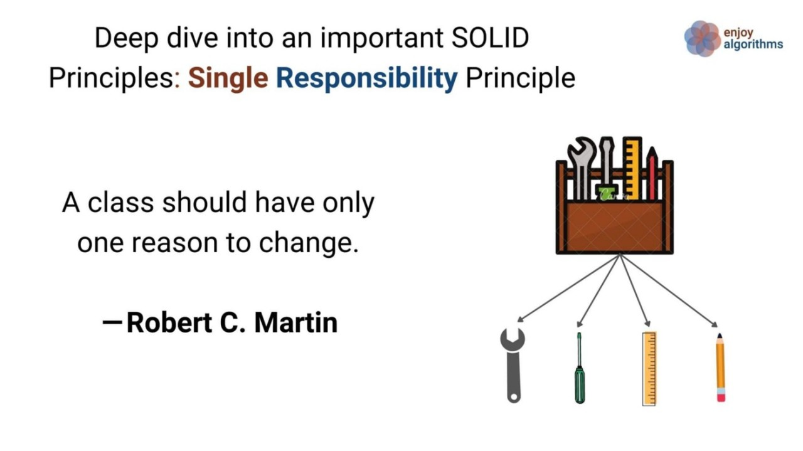

# FOP Valley

As of your Fundamental of Programming (FOP) Assignment, you're required to design a [Text Adventure](https://en.wikipedia.org/wiki/Text-based_game).

## 1 - Introduction


In this assignment, your task is to create an interactive fiction game where players can use the Command Line Interface (CLI) to interact with the system and navigate through the story. Your goal is to develop an intriguing narrative where players can acquire and control heroes and progress by overcoming challenges.

## 2 - Basic Requirement (Total - 22 marks)

### 2.1 Map Design (4 marks)

<div style="text-align:center">
    
</div>

#### 2.1.1 Requirements

1. Create a virtual game environment consisting of the following locations:
   - **Hometown**: A place where players can rest, upgrade their items, and engage in various activities.
   - **Forest**: An area where players can face monsters and collect loot for upgrading.
   - **Tower of Monsters**: The ultimate challenge that players must conquer to win the game.

2. Implement a teleportation system allowing players to move between locations seamlessly.

3. Design each location with a minimum size of 30x30, aligning with the provided descriptions.

4. Enable players to move freely using the W, A, S, and D keys.

### 2.2 - Creating archetypes (Total - 4 marks)

#### 2.2.1 Create 5 archetypes (2 marks)

Your task is to create five archetype classes based on the information provided in `archetypes.txt`. This file contains the names of archetypes along with their initial attributes, including `healthPoints`, `manaPoints`, `physicalDefense`, `magicalDefense`, `physicalAttack`, and `magicalAttack`. When a player creates a new character, the character's initial attributes should be determined by the data in `archetypes.txt`.

In your implementation, be sure to incorporate the principles of Object-Oriented Programming (OOP). For instance, you can structure your code as follows in Java:

```java
class Warrior extends Archetypes {
    // Define instance variables here
}
```

Additionally, the `Archetypes` class should include a method called `levelUp()`. This method can either be an abstract method or a concrete one, depending on your design choices.

#### 2.2.2 Implement leveling-up system (2 marks)

As characters progress on their journey, they have the ability to level up. Here are the general rules for character progression:

- During the first 10 levels, characters will require fewer experience points to level up, allowing for rapid early advancement.
- Each time a character levels up, their `healthPoints`, `manaPoints`, `physicalAttack`, `magicalAttack`, `physicalDefense`, and `magicalDefense` will increase.
- After reaching level 10, characters will level up at a slower pace.
- The maximum attainable level for characters is set at 99.
- The rate of attribute increase upon leveling up will vary based on the character's archetype:
  - `Warrior`: Health Points and defenses will receive significant boosts.
  - `Mage`: Magical Attack and Mana Points will experience substantial improvements.
  - `Rogue`: Both Physical Attack and Physical Defense will be enhanced.
  - `Paladin`: All forms of Attack will become more potent.
  - `Archer`: Physical Attack will be substantially strengthened.
- You are required to create a custom leveling-up algorithm for each archetypes.

### 2.3 - Design Monster (Total - 3 marks)

In any RPG (Role-playing game), monsters are a common feature. While keeping in mind that you are not restricted in designing your monster class, you may consider designing the Monster class as follows:

```java
// Define the Monster class to represent in-game monsters.
class Monster {
    String name;            // Name of the monster.
    int healthPoints;       // Current health points of the monster.
    int manaPoints;         // Current mana points of the monster.
    int physicalAttack;            // Attack attribute for dealing damage.
    int magicalAttack;            // Attack attribute for dealing damage.
    int physicalDefense;           // Defense attribute for mitigating damage.
    int magicalDefense;           // Defense attribute for mitigating damage.
    List<Ability> abilityList; // List of abilities that the monster can use.
}
```

#### 2.3.1 Requirement

1. Design **at least 5 unique monsters** that are scattered throughout the *Tower of Monster*.
2. Utilize inheritance to avoid redundant code.

### 2.4 - Design abilities (6 marks)

The heroes usually have their own abilities. The abilities could have special effect, including `Silence`, that is, making the opponent unable to cast a skill on your character; Perhaps `Damage`, that is, merely cause damage to the opponent.

Create at least 3 abilities for each archetypes. These abilities will only become accessible once the character reaches a specific level. To illustrate, let's introduce a character named the "Barbarian." The first abilities, dubbed "Roaring," will unlock and become usable once the character reaches level 5.

```md
Barbarian
--> HP: [:::::           ] (45 / 60)
--> MP: [//////////////  ] (80 / 100)
+-------------------------------------------------------------+
OPERATION: 1 / 3

>> Starter
[S1] Attack
[S2] Defend
[S3] Heal                   < -20 MP, +200 HP, ->
[S4] Use item
[S5] Escape

>> Abilities
[A1] Roaring                < -10 MP,    0 HP, Cast silence>
[A2] <Locked - 10>
[A3] <Locked - 15>
[A4] <Locked - 20>
+-------------------------------------------------------------+
```

Regardless of the abilities designed, you must include the following status effects:

| Effect   | Explanation                                           |
| -------- | ----------------------------------------------------- |
| Stunning | Prevents opponents from taking any action             |
| Poison   | Causes opponents to gradually lose HP over a few rounds |
|          |                                                       |

### 2.5 Round-based Battle System (5 marks)

Now that we have archetypes, monsters, and abilities in place, the next step is to implement the battle system. In a text-based RPG game, players are allowed to engage in round-based battles through interfaces or command-line operations.

During each round, players can make moves, including using abilities or making attacks. The number of operations a player can perform in one round may increase as their character levels up.

The battle will only end if the player wins, loses, or the player chooses to exit the game. Most importantly, the player and monster can cast abilities on each other.

```md
> You have HIT the skeleton warrior, causing 151 damage!

Skeleton Warrior
--> HP: [::              ] (27 / 60)
--> MP: [//////////////  ] (80 / 100)

> CRITICAL! Skeleton Warrior has SLASHED you for 57 damage!

Barbarian
--> HP: [:::::           ] (45 / 60)
--> MP: [//////////////  ] (80 / 100)
+-------------------------------------------------------------+
OPERATION: 1 / 3

>> Starter
[S1] Attack
[S2] Defend
[S3] Heal                   < -20 MP, +200 HP, ->
[S4] Use item
[S5] Escape

>> Abilities
[A1] Rabid Lunge            < -10 MP,    0 HP, Cast silence>
[A2] <Locked - 10>
[A3] <Locked - 15>
[A4] <Locked - 20>
+-------------------------------------------------------------+
```

## 3 - Extra Feature Requirement (Total - 15 marks)

### 3.1 - Save game functionality (4 marks)

It would be a great pity if someone couldn't save their game progress. Without the ability to save, they'd have to replay the same content repeatedly, which can become monotonous. To enhance the player experience, it's crucial to provide a way for them to record their current game status so they can pick up their progress next time. Additionally, the game could remind them to save their progress before exiting, in case they forget to do so. Players would greatly appreciate this feature, as it ensures they don't lose their hard-earned progress. Consider using a database and the knowledge you have acquired in File I/O for implementing this functionality.

### 3.2 - Abnormal input Handling (2 marks)

Mistakes can occur, whether unintentionally or intentionally. Therefore, our game should be capable of handling these abnormal inputs wisely and, perhaps, provide valuable feedback to inform the player about what's wrong with the input. It could be a typo or an unrecognized command.

### 3.3 Weapon System (7 marks)

#### 3.3.1 Design 1 weapon for each archetypes (2 marks)

Weapons can be a significant attraction for players. A good weapon can greatly enhance the player's engagement with the game, motivating them to explore and seek out these weapons. Hence, design 1 weapon for each archetypes. Each archetype will have their weapon since level 1.

However, not all weapons are suitable for every archetype. Clearly, a barbarian is not suited for wielding a bow; instead, they should wield a sword. Similarly, a wizard would probably not use a gun, as wizards tend to harness the power of magic to combat monsters.

The provided code snippet serves as a valuable reference for designing weapons in your game. While you are not limited to the specific naming convention or data types, it's essential to include all the mentioned elements for a comprehensive weapon design.

```java
// Define a 'Weapon' class to represent in-game weapons
public class Weapon {
    String name;                // The name of the weapon
    String archetype;           // The archetype this weapon is associated with
    String description;         // A description of the weapon
    int physicalAttack;         // Physical attack power of the weapon
    int magicalAttack;          // Magical attack power of the weapon
    int healthPoint;            // Health Point provided by the weapon
    int physicalDefense;        // Physical defense provided by the weapon
    int magicalDefense;         // Magical defense provided by the weapon
    List<WeaponEffect> effects; // List of special effects associated with the weapon
}
```

#### 3.3.2 Upgrade the weapon (2 marks)

Furthermore, a weapon should be upgradeable to gain additional effects as the game progresses. As monsters become increasingly formidable, the player's weapon should evolve to match the rising challenge, ensuring that it remains effective throughout the game.

Consider the following `View Weapon Information`:

```bash
Deathsong +7
+--------------------------------+
| Archetype          |  Wizard   |     
| Physical Attack    |  48 + 15  |
| HealthPoint        |  40 + 23  |
+--------------------------------+
```

The number `+7` should indicate the weapon has been upgraded successfully for 7 times already. It is worth noting that the color of `+7` displayed in the console and the `+23` which is attribute upgraded should be marked in different color for the player to recognize it easily.

#### 3.3.3 Blacksmith Shop (3 marks)

The player cannot upgrade their weapon independently, as this would severely disrupt game balance. Instead, they should visit a specialized location, such as a blacksmith shop, where they must pay for both the necessary materials and the upgrade costs

```bash
+=========================================+
+        A professional blacksmith        +
+=========================================+
⠀⠀⠀⠀⠀⠀⠀⠀⠀⠀⠀⢀⣀⠀⠀⠀⠀⠀⠀⠀⠀⠀⠀⠀⠀⠀⠀⠀⠀⠀
⠀⠀⠀⠀⠀⠀⠀⠀⠀⠀⣰⣿⣿⣷⡄⠀⠀⠀⠀⠀⠀⠀⢠⣄⣤⣦⣤⣀⠀⠀
⠀⠀⠀⠀⠀⠀⠀⠀⠀⠀⢿⣿⣿⣿⡇⠀⠀⠀⠀⠀⠀⠀⠀⠈⠉⠛⠿⠟⠀⠀
⠀⠀⠀⠀⠀⠀⠀⠀⣠⠀⠘⢿⣿⠟⠀⢠⡀⠀⠀⠀⠀⠀⠀⠀⣰⡗⠀⠀⠀⠀
⠀⠀⠀⠀⠀⢠⣾⠀⣿⠀⣷⣦⣤⣴⡇⢸⡇⠀⣷⠀⠀⠀⠀⣰⡟⠀⠀⠀⠀⠀
⠀⠀⠀⠀⠀⣿⣿⠀⣿⣤⣈⣉⣉⣉⣠⣼⡇⠀⣿⡆⠀⠀⣰⡟⠀⠀⠀⠀⠀⠀
⠀⠀⠀⠀⠀⣿⣿⠀⣿⣿⣿⣿⣿⣿⣿⣿⡇⠀⣿⠇⠀⠀⠛⠀⠀⠀⠀⠀⠀⠀
⠀⠀⠀⠀⠀⠛⠛⠀⠛⠛⠛⠛⠛⠛⠛⠛⠃⠀⠛⠀⠀⠀⠀⠀⠀⠀⠀⠀⠀⠀
⠀⠀⠀⠀⣤⣤⣤⣤⣤⣿⣿⣿⣿⣿⣿⣿⣿⣿⣿⣿⣿⣿⣇⠀⠀⠀⠀⠀⠀⠀
⠀⠀⠀⠀⠈⠻⣿⣿⣿⣿⣿⣿⣿⣿⣿⣿⣿⣿⣿⣿⣿⣿⣿⣿⣷⣤⠀⠀⠀⠀
⠀⠀⠀⠀⠀⠀⠈⠙⠛⣿⣿⣿⣿⣿⣿⣿⣿⣿⣿⣿⣿⣿⡿⠟⠋⠀⠀⠀⠀⠀
⠀⠀⠀⠀⠀⠀⠀⠀⠀⠿⠿⠿⣿⣿⣿⣿⣿⣿⣿⠿⠿⠿⠇⠀⠀⠀⠀⠀⠀⠀
⠀⠀⠀⠀⠀⠀⠀⠀⠀⠀⠀⣰⣿⣿⣿⣿⣿⣿⣿⣧⡀⠀⠀⠀⠀⠀⠀⠀⠀⠀
⠀⠀⠀⠀⠀⠀⠀⠀⢀⣠⣾⣿⣿⣿⣿⣿⣿⣿⣿⣿⣿⣦⡀⠀⠀⠀⠀⠀⠀⠀
⠀⠀⠀⠀⠀⠀⠀⠘⠛⠛⠛⠛⠛⠛⠛⠛⠛⠛⠛⠛⠛⠛⠛⠛⠃⠀⠀⠀⠀⠀
+=========================================+
> Which weapon would you like to upgrade?
+=========================================+

[1] DeathSong (+6 -> +7)
    - Price: 15000/ 700
    - Changes
        - Attack: 76 -> 79
        - Strength: 82 -> 89

[A] View More

>
```

The upgrade interface will encompass all the necessary information on a single page. This includes the upgrade fee, required materials, and the expected changes to the weapon upon upgrading.

Please note that the values will be presented in the format (a/b), where 'a' represents the current available resources in the player's inventory, and 'b' represents the resources needed for the upgrade.

### 3.4 Colorful text (2 mark)

It would be more interesting if certain keywords could be displayed in different colors. For example, it would provide a clearer reminder if the materials required for upgrading the weapon are marked in green when they are sufficient and in red when they are insufficient. You can implement this feature easily by searching on Google or using ChatGPT. You might found some useful resources [here](https://github.com/fyiernzy/Assignment-Suzume/blob/main/suzume/src/main/java/com/assignment/suzume/constants/FontStyle.java).

## 4 - Reminders

### 4.1 Modularity

#### 4.1.1 Object-Oriented Programming (OOP)

You need to apply the principles of Object-Oriented Programming (OOP) in your code to eliminate redundant code. It is important to grasp the concept of abstraction and effectively utilize classes, abstract classes, interfaces, and enums. Let's consider the following code as an example:

```java
class Monster {
    int healthPoints;
    int mana;
    List<String> status;    
}

class Hero {
    int healthPoints;
    int mana;
    List<String> status;
}
```

Instead of duplicating the variables `healthPoints`, `mana`, and `status`, we can create a suitable parent class to achieve abstraction. For instance:

```java
class Character {
    int healthPoints;
    int mana;
    List<String> status;
}

class Monster extends Character {

}

class Hero extends Character {

}
```

By refactoring the code in this manner, we indeed improve scalability and maintainability.

#### 4.1.2 Single Responsibility Principle (SRP)

<div style="text-align:center">
    
</div>

The Single Responsibility Principle is a fundamental programming principle that states that *A class should have only one reason to change.* It emphasizes that each class should be responsible for a single behavior or functionality.

In the given example, while applying OOP, it is important to ensure that each class is responsible for its own specific behavior. For instance, a `Hero` class may be responsible for attacking monsters or healing teammates, but it should not handle tasks unrelated to its core purpose, such as interacting with the operating system or managing database connections. Applying the SRP helps in maintaining cohesive and focused classes.

### 4.2 Using Git and Github for Cooperation

#### 4.2.1 Stop using Whatsapp or Telegram for exchanging .zip file!

It's quite common for newcomers who have no prior experience in programming to collaborate with others by sharing .zip files or sending .java files. However, this approach can lead to several issues.

1. The recipient needs to review all the code to identify the changes made, which can be time-consuming and error-prone.

2. If the recipient accepts all the changes and a bug is later discovered, it becomes challenging to revert to a bug-free version.

3. Frequent code changes can create confusion, especially when files are shared with different names or under the same name.

Therefore, it's advisable to refrain from using platforms like WhatsApp or Telegram for exchanging .zip files. Instead, consider using version control systems like Git and platforms like GitHub or Bitbucket, which are designed for efficient and collaborative code management.

<div style="text-align:center">
    
</div>

Among the various version control systems (VCS) available, Git stands out as one of the best options. Although some people may mistakenly believe that Git and GitHub are synonymous, they are, in fact, distinct entities.

Git is a distributed version control system designed to track changes in computer files. It excels at facilitating collaborative software development among programmers. Its key objectives include speed, data integrity, and support for distributed and non-linear workflows.

On the other hand, GitHub serves as an online hosting service specifically tailored for software development and version control using Git. It enhances Git's capabilities by providing features such as access control, bug tracking, software feature requests, task management, continuous integration, and project wikis.

In your assignment, it is crucial for you and your teammates to leverage Git and GitHub for effective team cooperation. Merely relying on copying and pasting or sharing ZIP files might suffice for small projects. However, as the codebase grows significantly, such approaches can lead to disastrous consequences. Utilizing Git and GitHub ensures streamlined collaboration and mitigates the challenges associated with managing large-scale projects.

#### 4.2.2 Recommended resources on studying Git

You might refer to the [Missing Semester | Lecture 6 | Version Control (Git) (2020)](https://www.youtube.com/watch?v=2sjqTHE0zok) and [GitHub Basics Tutorial - How to Use GitHub](https://www.youtube.com/watch?v=x0EYpi38Yp4) for more details.

#### 4.2.3 Brief Guideline on Using Git

```bash
# Configure your Git with a username and email
git config --global user.name "Your Name"
git config --global user.email "youremail@yourdomain.com"
```

If you've recently downloaded [Git](https://git-scm.com/), it's essential to set up your username and email. This information helps identify who made specific changes. If you have any inquiries about the changes, you can easily reach out to the contributor via email.

```bash
# Clone your repository from GitHub
cd path/to/your/code
git clone <GitHub_Repository_URL>
```

Once your Git configuration is in place, the next step is to register an account on GitHub and create a new repository. Copy the GitHub repository URL and paste it into the code snippet as indicated.

```bash
# Share your changes with your team
git add .
git commit -m "✨ Added new features"
git push
```

After making changes, like creating a new function such as `Login`, and wanting to share your work with your team, you should push the changes to the remote repository so that others can benefit from your code. Here's a breakdown of the commands:

- `git add .` stages all changes for commit.
- `git commit -m "your message"` provides a commit message to describe your changes.
- `git push` indicates that you've finalized your changes, at least in their current state, and you're ready to share them with others.

#### 4.2.4 Writing a good commit message

Writing informative commit messages and committing changes frequently not only helps others understand the modifications you've made but also enables easier access to specific older versions. A well-crafted commit message can serve as a helpful update log. Let's compare the following examples:

```bash
git commit -m "Add new files"
git commit -m "New updates"
git commit -m "Some changes"
```

and these messages:

```bash
git commit -m "Implement login authentication"
git commit -m "Fix bug in loading the file"
git commit -m "Implement embedded database for storage"
```

Which set of messages is more descriptive? Undoubtedly, the second set is more informative.

It is important to understand that commit messages should accurately reflect the changes made in the commit. The messages should be concise yet descriptive, providing a clear understanding of the modifications introduced. By following good commit message practices, developers can enhance collaboration and make it easier for others to navigate and utilize previous versions of the codebase.

### 4.3 Writing readable code

<div style="text-align:center">
    
</div>

Code is read more often than it is written. Avoid trying to be overly clever. While it may seem impressive to code swiftly with three-character variables or craft complex one-liners with numerous loops and clauses, both your present and future selves, along with your teammates, will benefit from the improved readability that comes from taking the time to give your methods and variables meaningful names, maintain proper spacing, and add meaningful comments. Always approach coding as if you'll need to explain it a week later, because the reality is, you will, even if it's just to yourself.

#### 4.3.1 Simple VS Complex Algorithm

Balancing the need to optimize an algorithm for time complexity in large-scale problems with the equally important factors of simplicity and readability is crucial. In the realm of software development, prioritizing code comprehensibility for all team members supersedes the pursuit of sophistication through intricate data structures and excessive reliance on lengthy, repetitive naming conventions, solely in an attempt to reduce time complexity from $O(x^3)$ to $O(x^2)$.

#### 4.3.1 Java Naming Conventions

There are generally three naming conventions, which are known as camelCase, snake_case and PascalCase. You might refer to [This Article](https://www.freecodecamp.org/news/snake-case-vs-camel-case-vs-pascal-case-vs-kebab-case-whats-the-difference/#snake-case) which clearly explains everything you would need for the naming convention.

## 5 - Contact me and my last word

For any questions or clarifications, please contact me, Ng Zhi Yang, via WhatsApp or Telegram at 017-7809298, or by email at 22004833@siswa.um.edu.my. However, WhatsApp and Telegram will always be the preferred choices. If you contact me through email and I don't reply within 24 hours, please feel free to contact me through those messaging apps.

This assignment is aimed at ensuring mastery of core concepts of flow control, File I/O, and especially Object-Oriented Programming. I hope you all will become more familiar with what an algorithm is, what computational thinking is, and certainly, master the concept of Object-Oriented Programming, which is a pillar of most programming in today's world.

Some of your friends might ask whether they should design a Graphical User Interface (GUI) for their assignment. However, it's important to note that there are no marks allocated for creating a GUI in this assignment. The reason for this is that the essence of Fundamentals of Programming (FOP) lies not in spending your time dealing with technologies like JavaFX or Java Swing.

It's perfectly acceptable to harness the capabilities of ChatGPT to assist you while working on your assignments. You may want to explore the use of an embedded database and incorporate SQL syntax in your code to streamline your work. Additionally, always keep modularity in mind and strive to avoid hard-coding. For example, if your project involves extensive dialogues for various conversations, it's advisable to store them in a .txt file rather than embedding them directly in the code. This approach makes modifications and amendments to the text considerably easier.

If you are seeking for the possible input and output, you might watch the following videos on Youtube:

1. [SanctuaryRPG - (Classic Text Adventure Game)](https://www.youtube.com/watch?v=_nuS86ITjIM)
2. [Open world Ascii based Python RPG | Python Curses](https://www.youtube.com/watch?v=DX1a8Uz12Xc)
3. [Python Text RPG Showcase | OldenRPG](https://www.youtube.com/watch?v=rz_2ml0AQ4k)
